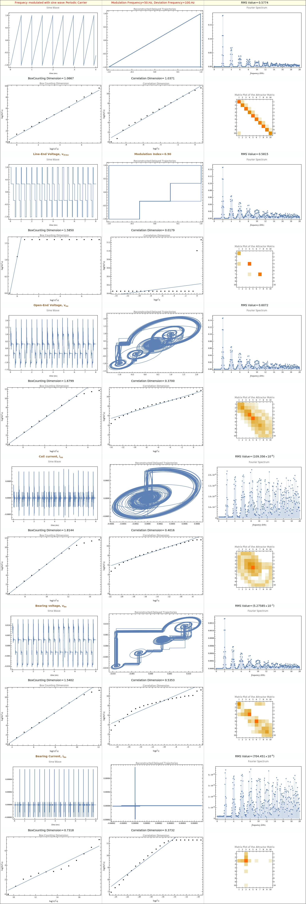

```mathematica
Clear["Global`*"];
ClearSystemCache[];
SetDirectory[NotebookDirectory[]];
<< ComModFracDimFuncs.nbd;
```

### Fsim[] Arguments usage::
#### Fref,
#### \[CapitalDelta]f,
#### CarrierModel,
#### Fourier Spectrum band,
#### modulation index]
### Fplot[] Arguments usage::
#### [return structure of Fsim[],
#### Correlation drop point for carrier,
#### Correlation drop point for line-end voltage,
#### Correlation drop point for open-end voltage,
#### Correlation drop point for coil current,
#### Correlation drop point for bearing voltage,
#### Correlation drop point for bearing current]


```mathematica
s21 = AbsoluteTiming@Fsim[50., 100., 2., 20000., 0.9];
```

```mathematica
Fplot[s21[[2]], 4, 0, 1, -1, 11, 0, 1, -1, 3, 0, 2, -4, 6, 0, 3, -6, 4, 0, 0, -5, 6, 0, 2, -5]
```


